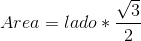
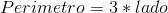

# Exercício 1.4. 
Implemente uma classe que modele um triangulo equilátero(lados iguais)
Atributos: lado, perímetro, área.
Métodos: calcArea(), calcPerímeto() e seus gets. O lado deverá ser
o único atributo inicializado via construtor.

Fórmulas:

